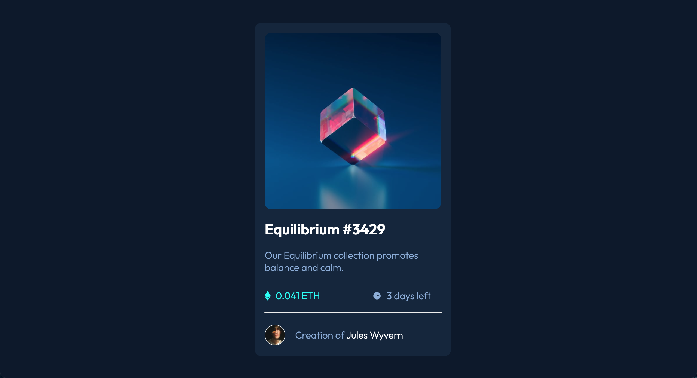

# Frontend Mentor - NFT preview card component solution

This is a solution to the [NFT preview card component challenge on Frontend Mentor](https://www.frontendmentor.io/challenges/nft-preview-card-component-SbdUL_w0U). Frontend Mentor challenges help you improve your coding skills by building realistic projects. 

## Table of contents  

- [Overview](#overview)
  - [The challenge](#the-challenge)
  - [Screenshot](#screenshot)
  - [Links](#links)
- [My process](#my-process)
  - [Built with](#built-with)
  - [What I learned](#what-i-learned)
  - [Continued development](#continued-development)
- [Author](#author)
- [Acknowledgments](#acknowledgments)

## Overview

### The challenge

Users should be able to:

- View the optimal layout depending on their device's screen size
- See hover states for interactive elements

### Screenshot



### Links

- Solution URL: [Github](https://github.com/kbasey/NFT-preview-card)
- Live Site URL: [Netlify](https://starlit-bavarois-21b0c3.netlify.app/)

## My process

### Built with

- Semantic HTML5 markup
- CSS custom properties
- Flexbox

### What I learned

Working on this project I learned overlay two images using the positions relative and absolute.

```
.img-equil {
    height: 18rem;
    width: 18rem;
    border-radius: 12px;
    margin: 1rem;
    display: block;
    position: relative;
    top: 0;
    left: 0;
}

.eye {
    opacity: 0;
    margin: 0 1rem;
    padding: 7.7rem;
    position: absolute;
    top: 3.4rem;
    border-radius: 12px;
    background-color: hsl(178, 100%, 50%, .5);
}
```

### Continued development

Moving forward I want to continue focusing on more complex CSS and using Javascript.

## Author

- Website - [Kieera Basey](https://github.com/kbasey)
- Frontend Mentor - [@kbasey](https://www.frontendmentor.io/kbasey/)


## Acknowledgments

I want to acknowlege StackOverflow, W3Schools and Google for all the help and support during this project.
